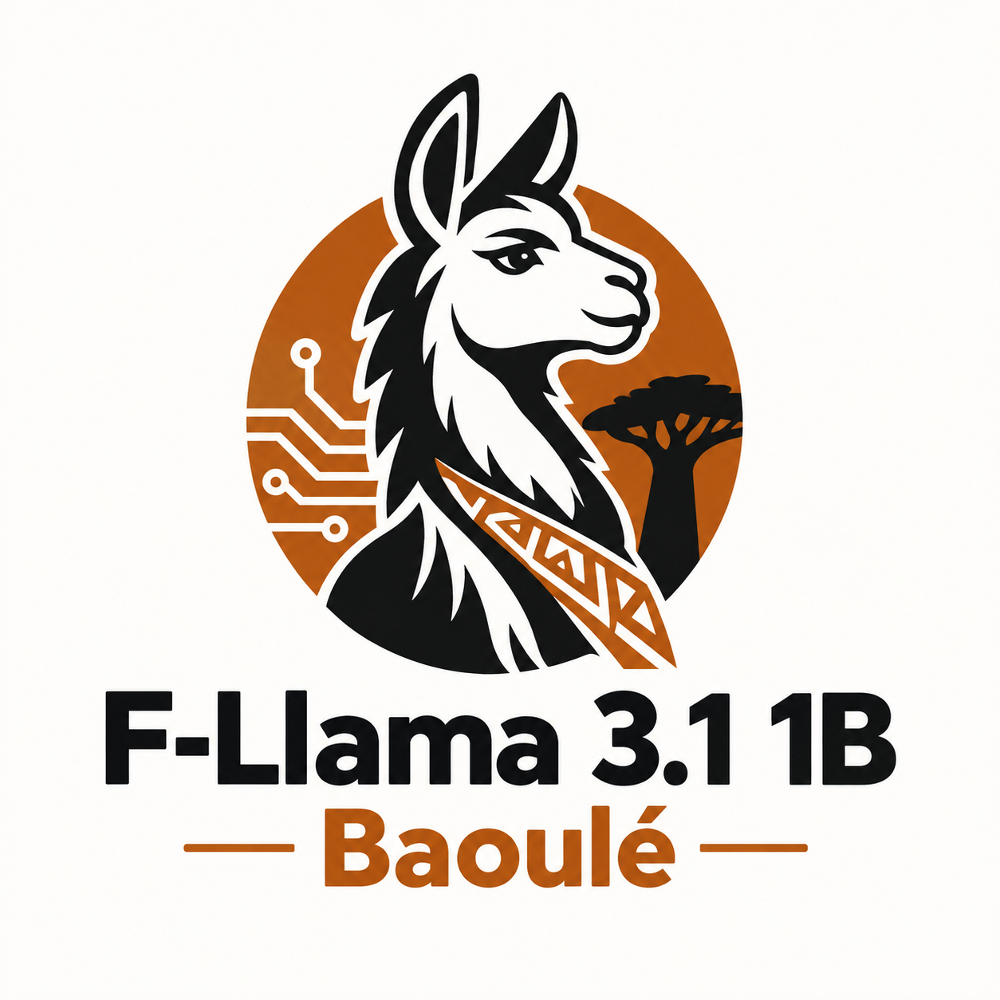

<div align="center">



# F-llama-3.2-1B-Baoulé

**Modèle de langage — Pré-entraînement continu en Baoulé**

[](https://huggingface.co/Tree-AI-lab/F-llama-3-2-1B-Baoule-1000_step)
[](https://github.com/Three-Ai-lab)
[](./Beyond_Chinchilla_Omega_Baoule.pdf)

</div>

---

## Présentation

Le Baoulé est une langue parlée par plusieurs millions de personnes en Côte d'Ivoire. Comme la grande majorité des langues africaines, elle est quasiment absente des corpus sur lesquels les grands modèles de langage sont entraînés. Ce projet part d'un constat simple : si l'IA doit être utile en Afrique, elle doit d'abord apprendre à parler ses langues.

**F-llama-3.2-1B-Baoulé** (Kouman AI) est une première réponse concrète à ce défi. C'est un modèle de complétion de texte brut basé sur **Meta Llama 3.2 1B**, adapté à la langue **Baoulé** via un pré-entraînement continu, développé par Tree AI Labs dans le cadre du projet [Kouman AI](https://github.com/Three-Ai-lab/Kouman-AI).

Ce modèle est un **base model** — il ne suit pas d'instructions et n'a pas été aligné pour le dialogue. Son rôle est de fournir une fondation ouverte sur laquelle des variantes spécialisées peuvent être construites.

---

## Méthodologie d'entraînement

Le code complet de création du modèle est disponible dans [`notebooks/F_llama_3_2_1B_baoule.ipynb`](./notebooks/F_llama_3_2_1B_baoule.ipynb). L'approche se déroule en quatre étapes.

### 1. Fusion des tokenizers

Le tokenizer de base de Llama 3.2 ne couvre pas le vocabulaire Baoulé. L'entraînement commence donc par fusionner le tokenizer Llama avec le tokenizer Baoulé [`Adjoumani/baoule_tokenizer`](https://huggingface.co/Adjoumani/baoule_tokenizer). Les tokens absents du vocabulaire Llama sont identifiés et ajoutés, et les embeddings du modèle sont redimensionnés en conséquence. Le vocabulaire résultant contient **128 259 tokens**.

### 2. Calcul dynamique des époques (Beyond Chinchilla Ω)

Le nombre d'époques n'est pas fixé arbitrairement. Il est calculé dynamiquement selon le cadre **Beyond Chinchilla** (Contexte B), documenté dans le [papier de recherche](./Beyond_Chinchilla_Omega_Baoule.pdf) :

- **Paramètres du modèle :** N = 1,23 × 10⁹
- **Budget de tokens visé :** D_emp = 2 × N ≈ 2,46 × 10⁹ tokens
- **Part Baoulé :** 70% de D_emp → ≈ 1,72 × 10⁹ tokens
- **Époques calculées :** `ceil(D_emp_baoulé / tokens_réels_baoulé)`

Ce calcul garantit que le modèle reçoit une exposition proportionnelle et suffisante aux données Baoulé.

### 3. Packing et interleaving des données

Les corpus Baoulé et Français sont tokenisés, puis découpés en blocs de **2 048 tokens** (packing). Les deux corpus sont ensuite mélangés en continu (*interleaving*) avec une répartition **70% Baoulé / 30% Français**.

Cette proportion n'est pas arbitraire : un entraînement séquentiel (tout le Baoulé, puis tout le Français) provoquerait un phénomène d'**oubli catastrophique** — le modèle oublierait la première langue en apprenant la seconde. L'interleaving évite ce problème en exposant le modèle aux deux langues à chaque pas de gradient.

### 4. Pré-entraînement continu par LoRA (QLoRA)

L'entraînement utilise **LoRA** (Low-Rank Adaptation) avec la configuration suivante :

| Paramètre | Valeur |
|-----------|--------|
| Rang LoRA (r) | 64 |
| Alpha | 128 |
| Modules ciblés | `q_proj`, `k_proj`, `v_proj`, `o_proj`, `gate_proj`, `up_proj`, `down_proj`, `embed_tokens`, `lm_head` |
| Quantification base | QLoRA NF4 (chargement) |
| Précision d'entraînement | `bfloat16` |
| Attention | SDPA (Scaled Dot-Product Attention natif PyTorch) |
| Batch size effectif | 4 × 8 (gradient accumulation) |
| Learning rate | 2 × 10⁻⁴ |
| Optimiseur | `adamw_torch_fused` |

À la fin de l'entraînement, les adaptateurs LoRA sont **fusionnés dans les poids du modèle de base** (`merge_and_unload`). Le modèle publié est donc un modèle dense standard, directement utilisable sans PEFT.

---

## Contexte et limites

Faire de la recherche en IA sans infrastructure dédiée, c'est naviguer avec les ressources que l'on a. Ce modèle a été entraîné sur **1 000 steps**, sur un seul GPU A100 alloué par Google Colab — un seul serveur, sans cluster, avec les contraintes de disponibilité que cela implique. En termes de budget de calcul, c'est objectivement petit pour une tâche de pré-entraînement continu.

Cela dit, les résultats sont corrects et suffisent pour publier une base open-source exploitable. L'objectif de cette publication n'est pas de prétendre à l'exhaustivité, mais de poser une première pierre et de partager le travail avec la communauté.

Le potentiel du modèle n'est clairement pas encore pleinement exploité : davantage de steps d'entraînement, sur un corpus plus large et avec plus de puissance de calcul, ouvriraient la voie à de meilleures performances. C'est précisément le défi logistique et matériel auquel Tree AI Labs fait face, et que nous cherchons à surmonter.

> Si vous souhaitez reprendre ce travail ou contribuer, l'entraînement sur un nombre de steps supérieur est la première piste à explorer. Le code dans le notebook est prêt à l'emploi.

---

## Utilisation

Que vous soyez chercheur, développeur ou simplement curieux de voir à quoi ressemble un modèle de langage qui génère du Baoulé — voici comment démarrer en quelques minutes.

### Installation

```bash
pip install torch transformers accelerate
```

### Génération de texte

```python
import torch
from transformers import AutoModelForCausalLM, AutoTokenizer

model_id = "Tree-AI-lab/F-llama-3-2-1B-Baoule-1000_step"

tokenizer = AutoTokenizer.from_pretrained(model_id)

device = "cuda" if torch.cuda.is_available() else "cpu"
model = AutoModelForCausalLM.from_pretrained(
    model_id,
    torch_dtype=torch.float16 if device == "cuda" else torch.float32,
    device_map="auto" if device == "cuda" else None
)

# Amorce en Baoulé
prompt = "N'anhouan"
inputs = tokenizer(prompt, return_tensors="pt").to(device)

with torch.no_grad():
    outputs = model.generate(
        **inputs,
        max_new_tokens=60,
        temperature=0.7,
        top_p=0.9,
        do_sample=True,
        pad_token_id=tokenizer.eos_token_id
    )

print(tokenizer.decode(outputs[0], skip_special_tokens=True))
```

Un script autonome est également disponible : [`inference.py`](./inference.py).

---

## Contenu du dépôt

```
├── notebooks/
│   └── F_llama_3_2_1B_baoule.ipynb   # Pipeline complet d'entraînement
├── Beyond_Chinchilla_Omega_Baoule.pdf # Papier de recherche
├── inference.py                        # Script d'inférence
├── config.json                         # Architecture du modèle
├── generation_config.json              # Paramètres de génération
├── tokenizer.json                      # Tokenizer fusionné
└── tokenizer_config.json
```

---

## Remerciements et sources

- [`Adjoumani/baoule_tokenizer`](https://huggingface.co/Adjoumani/baoule_tokenizer) — tokenizer Baoulé source utilisé pour la fusion de vocabulaire
- `Google Colab` — ressources GPU (A100) allouées pour l'entraînement du modèle

Enfin, merci à toutes celles et ceux qui s'intéressent à ce projet, qui le testent, qui le critiquent ou qui envisagent de le continuer. C'est pour eux que ce travail est publié en open-source.
---

## Citation

Si vous utilisez ce modèle ou ces travaux dans vos recherches, merci de citer le papier associé et de créditer **Tree AI Lab**.

```
@misc{treeailabs2025kouman,
  title   = {Beyond Chinchilla Omega Baoulé: Continuous Pre-training of Llama 3.2 on the Baoulé Language},
  author  = {Tree AI Lab},
  year    = {2025},
  url     = {https://github.com/Three-Ai-lab/kouman-Ilm-for-baoule}
}
```

**Liens :**
- Modèle Hugging Face : [Tree-AI-lab/F-llama-3-2-1B-Baoule-1000_step](https://huggingface.co/Tree-AI-lab/F-llama-3-2-1B-Baoule-1000_step)
- Organisation GitHub : [Three-Ai-lab](https://github.com/Three-Ai-lab)
